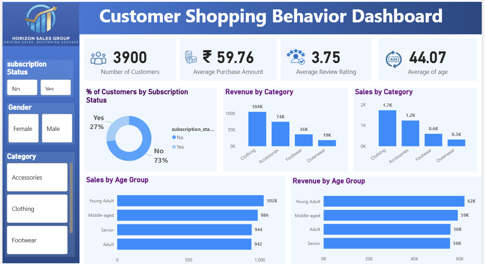

# Customer Shopping behavior Analysis

Project Overview

This project analyzes customer and sales data to identify sales trends, customer behavior, product performance, and useful business insights.
The project uses Python for data analysis, SQL for querying, and Power BI for interactive dashboard visualization.

Tools & Technologies

* Python — Pandas, NumPy, Matplotlib
* SQL — Data querying and analysis
* Jupyter Notebook — Exploratory Data Analysis
* Power BI — Interactive dashboard and visualization
* CSV — Dataset
 
Project Files

customer_shopping_behavior.csv  -  Dataset used for analysis
analysis.ipynb - Python-based data cleaning, EDA, and analysis
queries.sql - SQL queries used for data analysis
customer_shopping_behavior_dashboard.pbix - Power BI Dashboard
dashboard.png - Power BI Dashboard preview
customer_shopping_behavior.pptx - Project presentation
customer_shopping_behavior_report.pdf - Detailed project report

Analysis Performed

* Data cleaning and preprocessing
* Exploratory Data Analysis (EDA)
* Customer behavior analysis
* Sales and revenue analysis
* Product/category performance analysis
* SQL-based business analysis
* Data visualization using Power BI
* Identification of important business insights

Power BI Dashboard

Project Documentation

[View Project Presentation](customer_shopping_behavior.pptx)
[view Project Report](customer_shopping_behaviour.pdf)

Key Skills Demonstrated

* Data Cleaning
* Exploratory Data Analysis
* SQL Querying
* Data Visualization
* Business Analysis
* Power BI Dashboard Development
* Python Data Analysis

Author

Prerna Patil

This project is part of my data analytics portfolio and demonstrates practical skills in Python, SQL, and Power BI.
